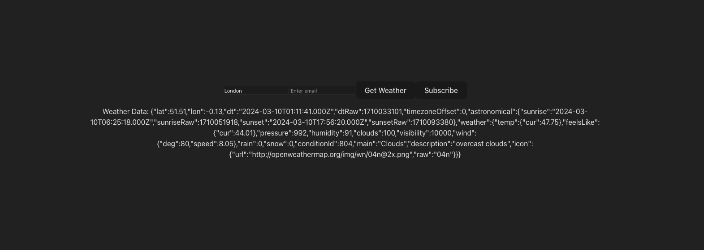
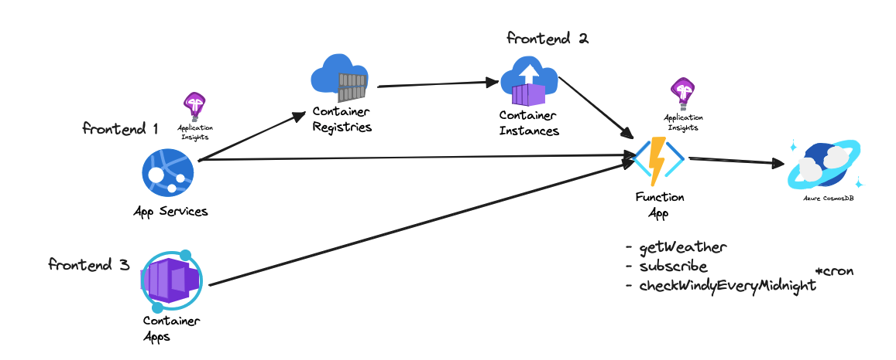

## Weather Tracker (Develop Azure compute solutions)

### screenshot



A web application that allows users to track weather updates in real-time for their chosen cities. The system also triggers Azure Functions for alerts(sending email) when a specific weather threshold is met (like if it's windy).

### Architecture



### Infrastructure

- Azure App Service Web App (Hosting the web application)
- Azure Container Registry (Storing Docker images for the app)
- Azure Container Instance (Running the containers for development/testing)
- Azure Functions (Weather alert system)
- Azure Container Apps (Running the containers in production)

### Diagram

```
User
|-> Web Application (Hosted on Azure App Service Web App)
   |-> Weather Alerts (Azure Functions)
      |-> Docker Images (Azure Container Registry)
         |-> Testing Containers (Azure Container Instance)
            |-> Running Containers (Azure Container Apps)
```

### Implementation Guide

1. Create an Azure App Service Web App.
2. Develop a basic web application that uses weather APIs.
3. Containerizable frontend.
4. Publish the container image to Azure Container Registry.
5. Test the application using Azure Container Instance.
6. Implement an Azure Function to send alerts when a specified weather threshold is met.
7. Integrate Azure Function with your web application.
8. Deploy the web application to Azure Container Apps.
9. Setup a CI/CD pipeline for your application and Function.
10. Setup Application insights
11. Push to GitHub
12. Document
